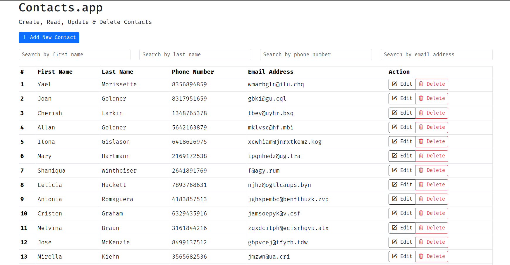

## Contact.app

in chapter 3 of [hypermedia systems](https://hypermedia.systems/a-web-1-0-application/), the authors talk of a simple contact management web app called Contact.app whose functionality is:

- view a list of contacts, including first name, last name, phone and email address
- search the contacts
- add a new contact
- view the details of a contact
- edit the details of a contact
- delete a contact

this example is a variation of that app, with all the said functionality.

## tech-stack

- ambiorix
- htmx
- sqlite (temp db)

## demo



## run app

1. restore dependencies by firing up R and running this:

    ```r
    renv::restore()
    ```

2. `index.R` is the entry point. you can `source()` the file in an
R session or run this in your terminal:

    ```r
    Rscript index.R
    ```

    that will start the web server. you can then visit [http://localhost:5000/](http://localhost:5000/) to
    view the app.
