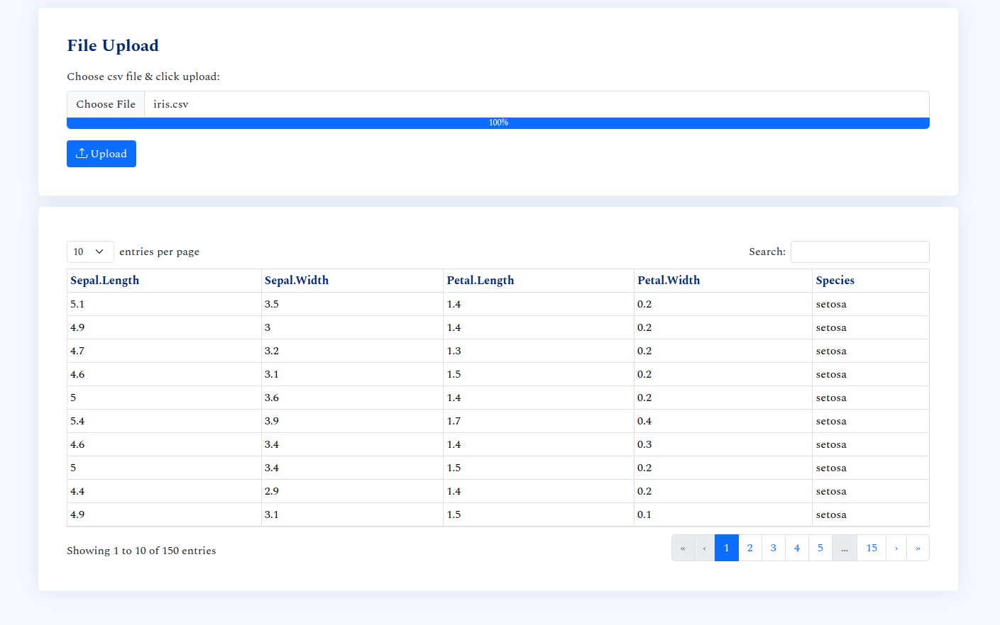

# File Upload

This example shows how you can parse, save & render file uploads.

For simplicity, it sticks to csv files. 

Also, the uploaded files are written to the working directory. Ideally, you 
should write to a database and perform any operations from there (searching, 
filtering, column selection etc.)

# Exhibits

- Before upload


- After upload



# Installation

1. Clone this repo and `cd` into the `todolist/` directory.
    ```bash
    git clone git@github.com:kennedymwavu/ambiorix-htmx.git
    cd ambiorix-htmx/file-upload/
    ```
1. Install the dependencies.
    ```bash
    Rscript install_deps.R
    ```
1. Add an env file (`.Renviron`) at the root dir of the project with the following content.
    ```r
    HOST = 127.0.0.1
    PORT = 8000
    ```
    You can change the values of the variables to suit your environment.

# Start app

`index.R` is the entry point of the app. Run the following command to start the app.
```bash
Rscript index.R
```
